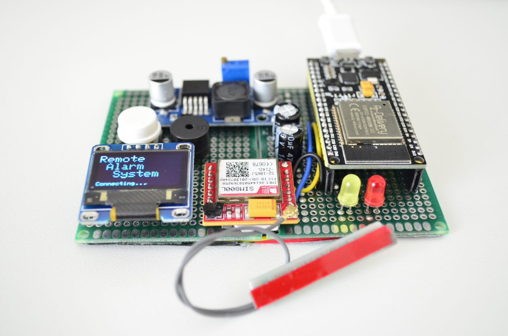

# GSM Remote Alarm System
The "_GSM Remote Alarm System_" is an experimental implementation that explores the concept of constructing a home alarm system. This repository showcases my endeavors in remotely managing an alarm system utilizing the [SIM800L][sim800lref] GSM module connected to an [ESP32][esp32ref] microcontroller. The main challenge I encountered was establishing effective communication and control between the GSM module and the microcontroller, enabling the transmission and reception of SMS messages. These messages were utilized to activate the alarm mode and even control external devices such as a relay.

For individuals interested in home automation and security, it is worth noting that the open-source [Home Assistant](https://www.home-assistant.io/), running on a Raspberry Pi, offers a more comprehensive approach to pursue. This repository is primarily intended for educational purposes.

<!--  -->


## Main features
- Activate/deactivate alarm status 
    - Red LED blinking
    - Buzzing constantly
- Raise an error when the modem is not responding or the signal is poor 
    - Turn on the yellow LED
    - Buzzing every 10 seconds
- Arm/Disarm SMS command 
- Push-button "ON"/"OFF" SMS command
- Display messages on a 0.96 inch OLED display


## What does it?
This module can be set in alarm mode by receiving an SMS command (e.g. "ALARM"). Also can reply an "ON" and "OFF" SMS command to the predefined contact number by pressing a push-button for 5 and 10 seconds, respectively. 


## Prerequisites
- Hardware:
    - [EPS32][esp32ref] microcontroller
    - [SIM800L][sim800lref] GSM Module
    - OLED display [SSD1306](https://randomnerdtutorials.com/esp32-ssd1306-oled-display-arduino-ide/) 128x64
    - [LM2596S][lm2596sref] DC-DC power supply step down module
    - Two red and yellow LEDs
    - A Piezo buzzer
    - Two 100 Ohm resistors for LEDs
    - A breadboard and some wires (or soldering prototype board)
- Software:
    - Arduino IDE with [ESP32 Add-on](https://randomnerdtutorials.com/installing-the-esp32-board-in-arduino-ide-windows-instructions/)
    - [Adafruit TFT display driver](https://github.com/adafruit/Adafruit_SSD1306) library


## Wiring
The wiring ESP32 is as follows:
- SIM800L GSM module:
    - RXD ➡ G16
    - TXD ➡ G17     
    - VCC ➡ **4.0V** (this must be provided by the [LM2596S][lm2596sref] power module)
- OLED display (I2C):
    - SCL ➡ G23      
    - SDA ➡ RXD 
    - Vin ➡ 3V3 (3.2V)
- LEDs pin:
    - Yellow ➡ G4
    - Red ➡ G5
- Buzzer pin ➡ G15
- Push button ➡ G2

**Important:** A large electrolytic capacitor (470 or 1000 uF) is certainly required in order to stabilize the GSM module with its current spike. It should be connected to the `GND` and `VCC` pins and as close as possible to the module.


## Code adjustment
SMS commands and Recipient contact number have to adjusted based on your needs. 
```CPP
// SMS commands 
#define ALARM_SMS      "ALARM"
#define ARM_SMS        "ON"
#define DISARM_SMS     "OFF"

// GSM contact recipent
#define RECIPIENT      "+123456789"
```

Other parameters work just fine with their default values but they can be also adjusted.
```CPP
// General parameters
#define GSM_TX_PIN     17       // pin
#define GSM_RX_PIN     16       // pin
#define BUZZER_PIN     15       // pin
#define STATUS_LED     4        // pin
#define ALARM_LED      5        // pin
#define PUSH_BUTTON    2        // pin
#define BUZZER_FRQ     2000     // Hz    
#define ALARM_TIMER    1800000  // ms
#define ARM_BTN_DLY    8000     // ms
#define DISARM_BTN_DLY 4000     // ms
#define BUZZER_CHANNEL 0        // PWM channel
#define BUFFER_LEN     128      // size

// OLD display
#define SCREEN_WIDTH   128 // OLED display width, in pixels
#define SCREEN_HEIGHT  64  // OLED display height, in pixels
#define OLED_RESET     -1  // reset pin # (or -1 if sharing Arduino reset pin)
```

## References
Some useful links that part of this work is based on them are as follows:

[esp32ref]: https://en.wikipedia.org/wiki/NodeMCU
[sim800lref]: https://lastminuteengineers.com/sim800l-gsm-module-arduino-tutorial/
[lm2596sref]: http://wiki.sunfounder.cc/index.php?title=LM2596S_DC-DC_Power_Supply_Step_Down_Module
*  https://lastminuteengineers.com/sim800l-gsm-module-arduino-tutorial/
*  https://www.developershome.com/sms/cmglCommand3.asp
